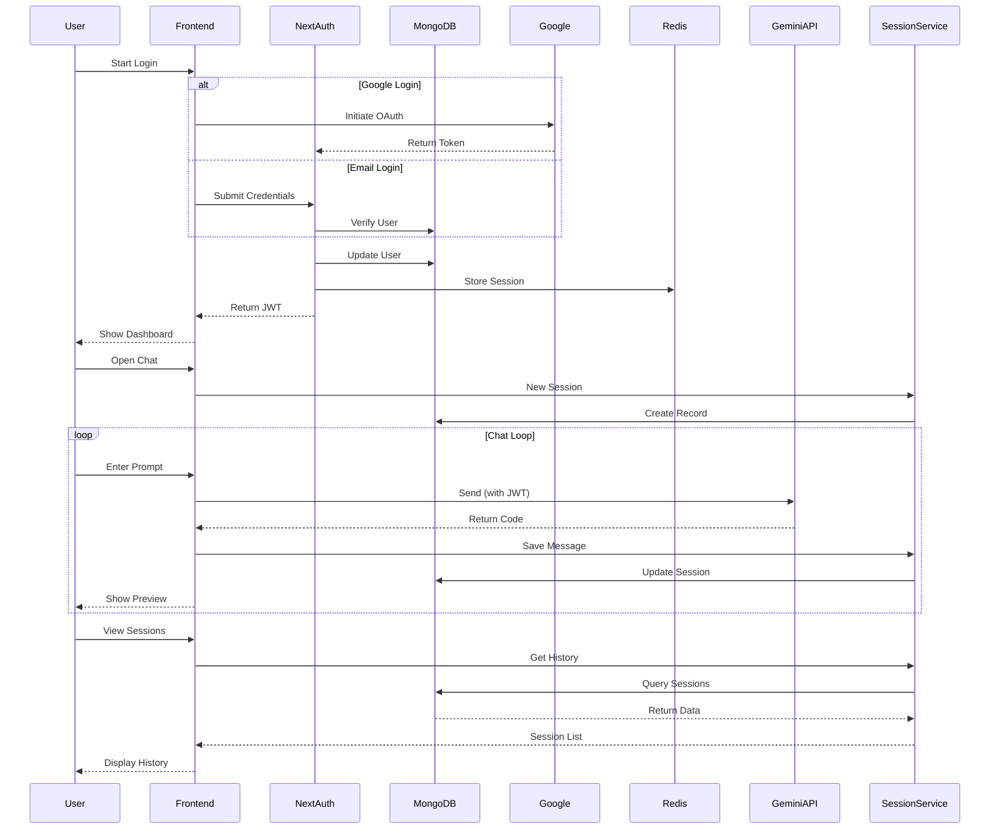

```mermaid
sequenceDiagram
    participant U as User
    participant F as Frontend
    participant N as NextAuth
    participant M as MongoDB
    participant G as Google
    participant R as Redis
    participant A as GeminiAPI
    participant S as SessionService

    U->>F: Start Login
    alt Google Login
        F->>G: Initiate OAuth
        G-->>N: Return Token
    else Email Login
        F->>N: Submit Credentials
        N->>M: Verify User
    end
    N->>M: Update User
    N->>R: Store Session
    N-->>F: Return JWT
    F-->>U: Show Dashboard

    U->>F: Open Chat
    F->>S: New Session
    S->>M: Create Record
    loop Chat Loop
        U->>F: Enter Prompt
        F->>A: Send (with JWT)
        A-->>F: Return Code
        F->>S: Save Message
        S->>M: Update Session
        F-->>U: Show Preview
    end

    U->>F: View Sessions
    F->>S: Get History
    S->>M: Query Sessions
    M-->>S: Return Data
    S-->>F: Session List
    F-->>U: Display History
```